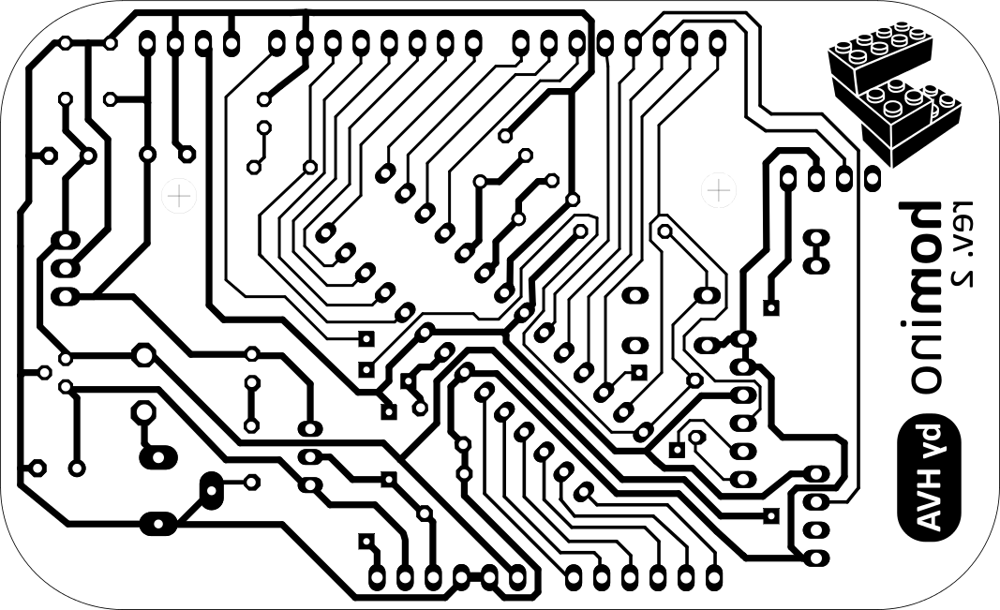
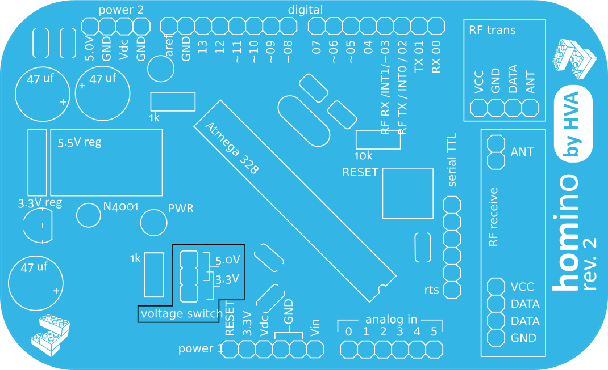

Homino
======

What is Homino?
---------------

Homino is a diy Arduino Duemilanove/Uno compatible board with some moloko vellocet addition
(e.g. featuring on-board 433Mhz RF transceiver for experiments on home-automation and microcontroller communication).
Homino is an open-hardware project by HVA (http://www.hv-a.com)

The board is based on Arduino open-hardware design, but revised in order to be made using a single-sided copper board and low-tech techniques like toner-transfer etching.
The connectors in Homino are arduino shields compatible, but the board comes in Altoids tin can format, so you can have the mints while soldering all those little components.

How does Homino compare to Arduino?
-----------------------------------

Homino replicates almost all the features of Atmega328 based Arduino, with a few design limitations:

- No on-board usb-to-ttl, you will need an external usb-ttl cable to program it or a serial port adapter that can handle RS232 level switching (however auto-reset works flawlessly)
- No ISP connector

There is fortunately some nice additions too:

- Selectable 5V/3.3V operation mode (through an old style jumper, we feared a slide switch could be more dangerous)
- On-board RF communication based on low-cost 433Mhz radio modules like the ones from SeeedStudio, allowing the interoperability with current low-cost 433 MHz remote controlled devices. Homino will most likely work with all 433Mhz popular power outlet sockets.
Communication between several Homino boards or any other 433Mhz RF enabled microcontroller is also very easily done through VirtualWire library.

How do I build Homino?
----------------------

Homino is designed to be built on a homemade custom produced pcb using single sided boards.
We successfully built several boards using tone-transfer method using a photocopier and common light magazine coated paper, you can use transparency film, but the magazine solution proved to be the most reliable and cheapest in our experience.
Homino board is rather dense and has some thin routes and small gaps between them, so it is not the easiest design to use with tone-transfer based etching, but if you're careful it works very well.

List of components:

- PCB single sided board (you can cut 3 Homino boards from a 160x100 sheet)
- 1 x Atmega328 MCU
- 1 x 28 way DIL socket
- 3 x 47uF capacitors
- 5 x 0,1 uF ceramic capacitors
- 2 x 22 pF ceramic capacitors
- 1 x 5V voltage regulator
- 1 x 3.3 V voltage regulator
- 1 x N4001 diode
- 2 x 1k resistor
- 1 x 10k resistor
- 2 x leds
- 1 x 16Mhz crystal
- 1 power jack (optional)
- female pin sockets
- 1 x 6 way male pin header
- 1 x 3 way male pin header with jumper
- RF transmitter and receiver modules

The cost of the components is about 9,5 euros when bought in very small quantities from online distributors like Farnell or RS, if you buy larger quantities or have cheaper providers, the total cost can be quite lower. RF modules from SeeedStudio cost $4,9.
Ideal cost including RF modules should be around 12 US$.

Useful links
------------

Arduino libraries for RF projects
- http://code.google.com/p/rc-switch/
- http://www.airspayce.com/mikem/arduino/

Low-cost RF modules compatible with Homino
- http://www.seeedstudio.com/depot/433mhz-rf-link-kit-p-127.html?cPath=19_22

Credits
-------

Homino is obviously Open Hardware, and all the files are distributed under a
<a rel="license" href="http://creativecommons.org/licenses/by-nc-sa/3.0/">Creative Commons Attribution-NonCommercial-ShareAlike 3.0 Unported License</a>
.

HVA lego-logo is property of 'HVA - hermanitos verdes architetti' (http://www.hv-a.com) and shouldn't be used without permission.

Homino is inspired and based on other Arduino compatible projects, for example:

http://hacks.ayars.org/2013/05/ayrduino-single-sided-arduino-clone.html
http://vonkonow.com/wordpress/2012/10/nanino-the-diy-friendly-arduino
